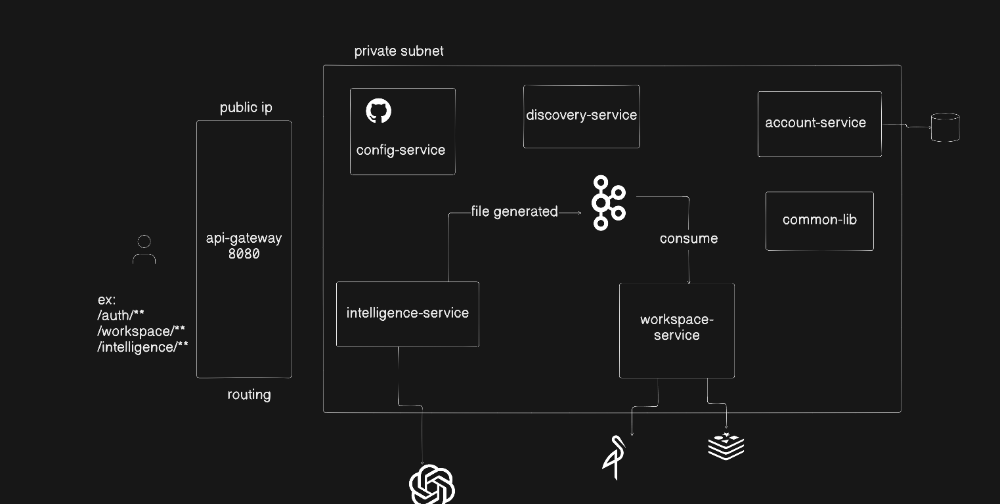

# Distributed Prompt2Prod

> **Describe what you want to build. Get running code, live.**

An AI-powered code generation platform built on event-driven microservices. Users describe an application in natural language — the platform streams AI-generated code in real time, persists files to object storage, and deploys a live preview to Kubernetes.



---

## ✨ Features

- **Conversational code generation** — chat with an AI that writes full project files, streamed token-by-token via SSE
- **Real-time workspace** — generated files are saved asynchronously and appear in the project file tree instantly
- **One-click deploys** — every project can be deployed to Kubernetes for a live preview
- **Subscriptions & billing** — Stripe-powered plans with usage gating
- **Resilient by design** — Saga choreography over Kafka guarantees no file write is lost or duplicated

---

## 🏗️ Architecture

Seven Spring Cloud services behind a single public gateway. Everything else lives in a private subnet — services are unreachable from the internet and discover each other via Eureka.

| Service | Port | Responsibility |
|---|---|---|
| `api-gateway` | 8080 | Single entry point — JWT validation, path-based routing |
| `config-service` | 8888 | Centralized, Git-backed configuration |
| `discovery-service` | 8761 | Eureka service registry |
| `account-service` | dynamic | Authentication, subscriptions, Stripe billing |
| `intelligence-service` | dynamic | AI code generation (Claude API + SSE streaming) |
| `workspace-service` | dynamic | Projects, file storage (MinIO), Kubernetes deployments |
| `common-lib` | — | Shared security config, DTOs, event contracts |

### Why this architecture?

- **Event-driven over REST chaining** — AI generation and file persistence are decoupled through Kafka. If the workspace service is down, no generated code is lost; events are replayed on recovery.
- **Saga choreography, not orchestration** — services react to events independently. No central coordinator, no single point of failure.
- **Idempotent consumers** — every event carries a `sagaId`; consumers track a `ProcessedEvent` table, so retries and redeliveries never produce duplicate writes.

---

## 🛠️ Tech Stack

| Layer | Technology |
|---|---|
| Language / Framework | Java 21, Spring Boot 3, Spring Cloud |
| AI | Spring AI + Claude API (Anthropic), streaming via SSE |
| Messaging | Apache Kafka — Saga choreography pattern |
| Persistence | PostgreSQL (data), MinIO (files), Redis (cache) |
| Infrastructure | Kubernetes (fabric8 client), Stripe (billing) |
| Service Mesh | Spring Cloud Gateway, Eureka, Spring Cloud Config |

---

## 🔄 Core Flow: Prompt → Deployed Code

```
 Client
   │  POST /chat/stream (JWT)
   ▼
 API Gateway ──────────────► Intelligence Service
                                │ 1. Calls Claude API
                                │ 2. Streams SSE tokens to client
                                │ 3. Publishes FILE_EDIT → Kafka
                                ▼
                             Workspace Service
                                │ 4. Consumes event (idempotency check)
                                │ 5. Persists file → MinIO
                                │ 6. Publishes FILE_SAVED → Kafka
                                ▼
                             Intelligence Service
                                  7. Marks ChatEvent CONFIRMED
```

**Failure handling:** if step 5 fails, the event is retried; the `sagaId` + `ProcessedEvent` table guarantees exactly-once effect on the consumer side. Unconfirmed ChatEvents are surfaced to the client so no edit silently disappears.

---

## 📡 Key API Endpoints

| Method | Path | Service | Description |
|---|---|---|---|
| `POST` | `/api/auth/signup` | Account | Register a new user |
| `POST` | `/api/auth/login` | Account | Login → JWT |
| `GET` | `/api/me/subscription` | Account | Current subscription info |
| `POST` | `/api/payments/checkout` | Account | Create Stripe checkout session |
| `GET / POST` | `/projects` | Workspace | List / create projects |
| `GET` | `/projects/{id}/files` | Workspace | Project file tree |
| `POST` | `/projects/{id}/deploy` | Workspace | Deploy project to Kubernetes |
| `POST` | `/chat/stream` | Intelligence | AI chat (SSE stream) |
| `GET` | `/chat/projects/{id}` | Intelligence | Chat history for a project |

---

## 🚀 Running Locally

### Prerequisites

- Java 21, Docker (& Docker Compose)
- An Anthropic API key
- A Stripe account (test mode is fine)
- A local or remote Kubernetes cluster (e.g. minikube / kind)

### 1. Start infrastructure

```bash
docker compose up -d   # PostgreSQL · Kafka · MinIO · Redis
```

### 2. Set environment variables

```bash
export ANTHROPIC_API_KEY=sk-ant-...
export STRIPE_SECRET_KEY=sk_test_...
```

### 3. Start services (in order)

```
config-service → discovery-service → account-service
→ workspace-service → intelligence-service → api-gateway
```

Configuration is pulled at startup from the external config repo:
[`promt2prod-config-server`](https://github.com/amanraj995567/promt2prod-config-server)

### 4. Verify

- Eureka dashboard: `http://localhost:8761`
- Gateway health: `http://localhost:8080/actuator/health`

---

## 📁 Project Structure

```
prompt2prod/
├── api-gateway/            # Routing, JWT filter
├── config-service/         # Spring Cloud Config server
├── discovery-service/      # Eureka server
├── account-service/        # Users, auth, Stripe
├── intelligence-service/   # Claude integration, SSE, Kafka producer
├── workspace-service/      # Files, MinIO, K8s deploys, Kafka consumer
├── common-lib/             # Shared DTOs, events, security
└── docs/
    └── architecture.png
```

---
